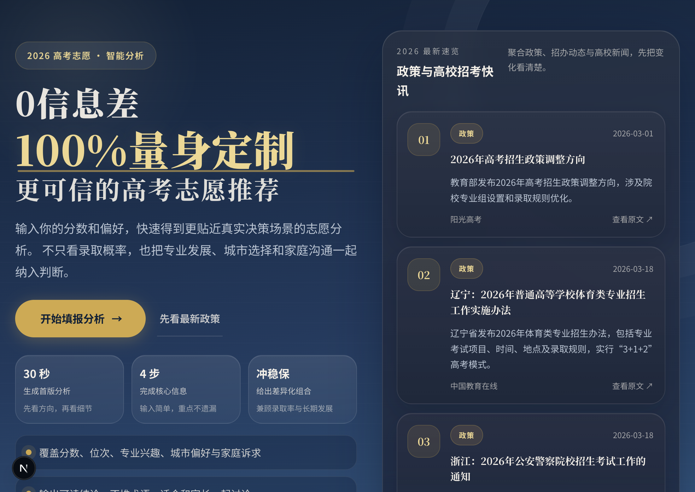

# 高考志愿 AI 助手

一个面向高考志愿决策场景的 Next.js Web 应用。  
它会结合政策变化、录取率与趋势判断，以就业结果为导向，生成更贴近真实决策的志愿分析报告。

## 页面预览



## 产品能力

- 4 步表单收集省份、分数、位次、选科、城市偏好、学校层次、家庭诉求和路径优先级
- 调用 AI 生成个性化志愿分析，输出学生定位、家庭总结、核心策略、冲稳保方案和就业趋势判断
- 报告页支持未支付脱敏展示，支付后解锁完整学校、专业与详细理由
- 集成虎皮椒支付，支持微信支付与支付宝
- 首页展示 3 条最新高考政策与高校招考摘要
- 新闻摘要采用 x-crawl + 搜索发现 + 原始 HTML 回退的多层抓取策略
- 已配置首页新闻的定时刷新能力

## 用户流程

1. 进入首页查看产品价值与最新政策摘要
2. 填写表单，提交省份、分数、位次、选科和偏好信息
3. 后端异步生成报告并返回报告 ID
4. 报告页先展示脱敏内容，用户可继续支付解锁完整分析
5. 支付成功后查看完整学校、专业、风险和就业趋势建议

## 技术栈

- Next.js 16 App Router
- React 19
- SQLite + better-sqlite3
- Node.js 原生 `node:test`
- x-crawl
- DeepSeek / Kimi / MiniMax 多提供商回退
- Tavily 搜索增强
- 虎皮椒支付

## 目录结构

```text
webapp
├─ app
│  ├─ api
│  ├─ form
│  ├─ lib
│  ├─ report
│  └─ page.js
├─ data
├─ public
├─ scripts
├─ tests
├─ package.json
└─ vercel.json
```

## 本地开发

### 1. 安装依赖

```bash
npm install
```

### 2. 配置环境变量

可以先复制 `.env.example` 再生成自己的 `.env.local`：

```bash
cp .env.example .env.local
```

常用变量如下：

```bash
DEEPSEEK_API_KEY=
DEEPSEEK_MODEL=deepseek-v4-flash
KIMI_API_KEY=
MINIMAX_API_KEY=
TAVILY_API_KEY=
XUNHU_APPID=
XUNHU_APPSECRET=
CRON_SECRET=
PREVIEW_MODE=false
```

说明：

- 至少配置一个 AI Key，推荐优先配置 `DEEPSEEK_API_KEY`
- DeepSeek 默认基础模型为 `deepseek-v4-flash`，如需更高能力模型可把 `DEEPSEEK_MODEL` 改为 `deepseek-v4-pro`
- 如果未配置支付密钥，支付接口会进入开发模式
- `CRON_SECRET` 用于保护定时刷新接口
- `PREVIEW_MODE=true` 时，生成接口会直接写入完整示例报告并自动解锁，适合纯前端演示

### 3. 启动项目

```bash
npm run dev
```

打开 [http://localhost:3000](http://localhost:3000)

## 可用脚本

```bash
npm run dev
npm run build
npm run start
npm test
npm run news:refresh
npm run rebuild:db
```

## 首页新闻摘要刷新

### 手动刷新

```bash
npm run news:refresh
```

### 自动刷新

- 首页只读取 `data/homepage-news.json` 缓存，不会在每次请求时现抓
- 如果缓存超过 24 小时仍未刷新，首页会继续展示已有缓存并标记“缓存待刷新”，避免退回到更旧的兜底内容
- `DEEPSEEK_API_KEY` 不可用时，刷新脚本会从官方页面标题、日期和正文自动提取摘要作为兜底
- Vercel Cron 会调用 `/api/cron/refresh-homepage-news`
- 当前固定每天刷新 1 次
- UTC 调度时间：
  - `0 0 * * *`
- 对应北京时间：
  - 08:00

## 招生计划数据准备

- `data/admission-plans.json` 是 2026 招生计划的结构化缓存入口，目前可先保持空数组
- 后续各省考试院或高校公布计划后，可把官方 PDF/Excel/页面解析为统一字段后写入 `items`
- 报告生成会优先读取已导入的当年招生计划；命中后会在方案中标记专业组、计划人数和官方来源
- 如果没有命中真实计划，系统会自动降级为“历年录取与公开资料参考”，并保留最终核验提醒

单条计划字段建议：

```json
{
  "year": 2026,
  "province": "浙江",
  "batch": "本科普通批",
  "school_code": "10335",
  "school_name": "浙江大学",
  "major_group": "专业组001",
  "major_code": "080901",
  "major_name": "计算机科学与技术",
  "subject_requirement": "物理+化学",
  "plan_count": 4,
  "source_name": "浙江省教育考试院",
  "source_url": "https://example.edu/official-plan",
  "published_at": "2026-06-20"
}
```

## 接口概览

- `POST /api/generate` 生成报告
- `GET /api/report/[id]` 查询报告
- `POST /api/pay/create` 创建支付订单
- `POST /api/pay/notify` 支付回调
- `GET /api/cron/refresh-homepage-news` 定时刷新首页新闻缓存

## 测试与构建

```bash
npm test
npm run build
```

项目当前包含：

- API handler 测试
- 首页新闻抓取与来源配额测试
- Tavily 查询构建测试
- 运行时工具测试

## 部署说明

推荐部署到 Vercel。

部署前请确认：

- 已配置 AI 服务密钥
- 已配置 `CRON_SECRET`
- 如需真实支付，已配置虎皮椒支付密钥
- 定时任务将由 `vercel.json` 自动声明

## Render 预览部署

如果你只是想在手机端查看前端表现，Render 可以按“预览环境”来部署：

- Runtime: `Node`
- Build Command: `npm install && npm run build`
- Start Command: `npm run start`
- Node Version: `20`

仓库里已经提供了 [render.yaml](file:///Users/caizhen/Desktop/Dev/高考志愿助手/webapp/render.yaml)，直接导入仓库即可。

仅做前端预览时，推荐这样处理：

- 将 `PREVIEW_MODE` 设为 `true`
- 不配置 AI Key 也可以完整走通“填写表单 → 生成报告 → 查看完整报告”
- 不配置支付密钥时，支付不会成为阻塞项
- SQLite 数据在 Render 普通预览环境里不是持久化存储，刷新实例后可能丢失，只适合临时演示
- 首页新闻展示依赖仓库内已有缓存文件，即使不手动刷新也能正常展示
- 当前 [render.yaml](file:///Users/caizhen/Desktop/Dev/高考志愿助手/webapp/render.yaml) 已默认把 `PREVIEW_MODE` 设为 `true`

## 静态预览部署

如果 Render 的免费 Web Service 额度已经用完，可以直接部署 `static-preview` 目录：

- 部署类型：`Static Site`
- Publish Directory：`static-preview`
- Build Command：留空即可

静态预览包含：

- `static-preview/index.html` 首页预览
- `static-preview/form.html` 表单预览
- `static-preview/report.html` 报告预览

特点：

- 不依赖 Next.js 服务端
- 不依赖数据库、AI、支付接口
- 适合只看手机端前端效果
- 可直接部署到 Render Static Site、GitHub Pages、Netlify 等静态托管平台

## 当前特性说明

- 首页新闻抓取已支持教育部原始 HTML 回退
- 阳光高考已支持“搜索发现链接 + 详情页抓取”
- 选稿阶段有来源配额策略，避免 3 条摘要都来自同一来源
- 首页已做桌面端与移动端适配优化
